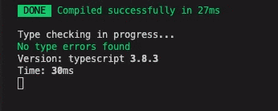

Delay fork-ts-checker-webpack-plugin output after friendly-errors-webpack-plugin's latest output.

If you want to seperate the ts typecheck into another thread to speed up build, you probably would use fork-ts-checker-webpack-plugin.

But when you also want to use friendly-errors-webpack-plugin with clearConsole=true, it's convenient to only show the latest typecheck result after the main compilation done.

